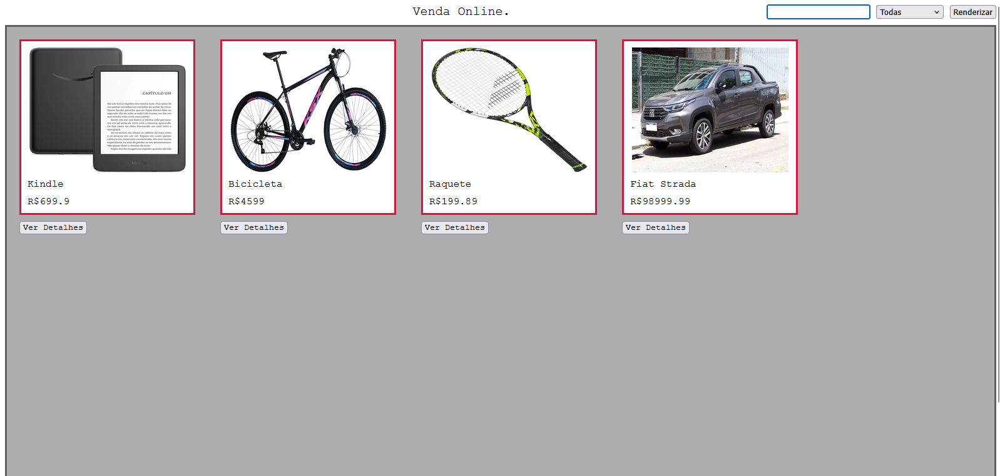
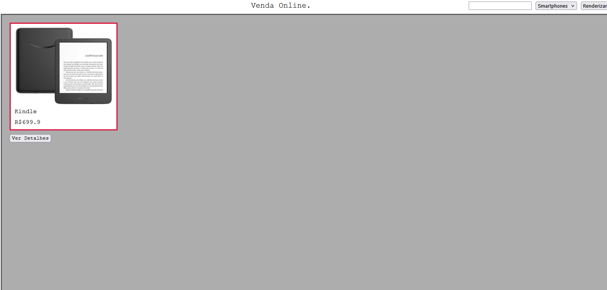
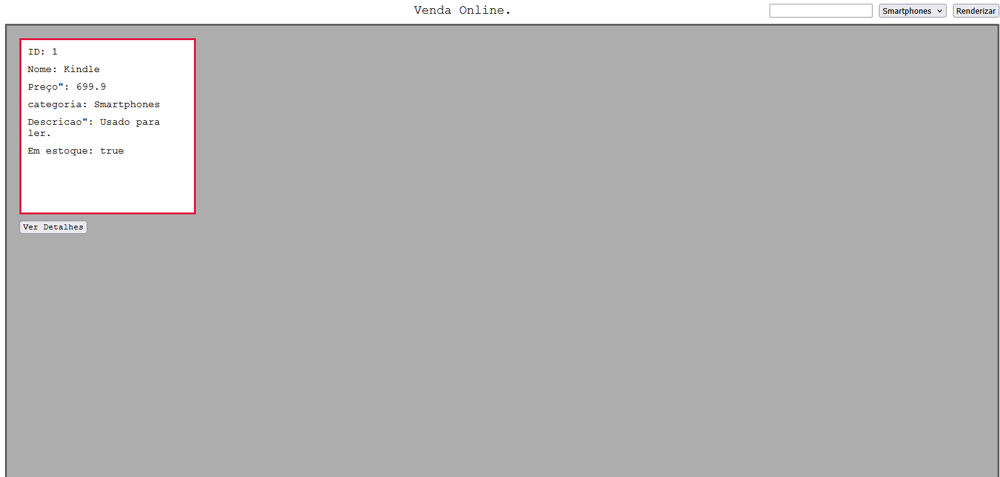
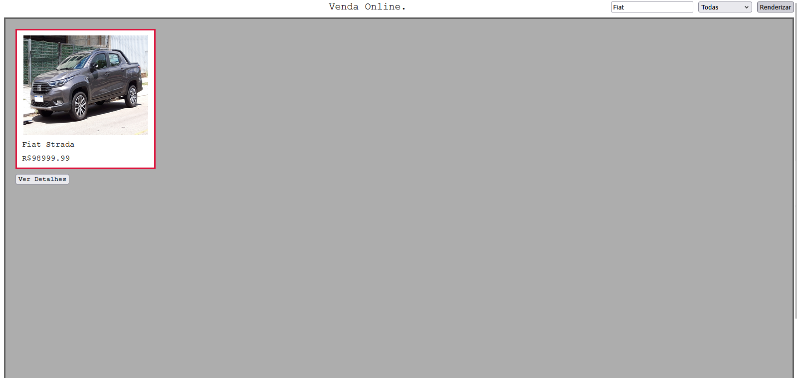
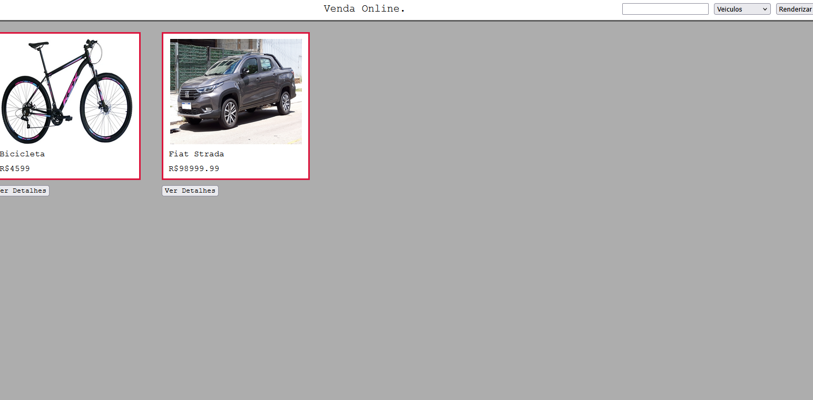
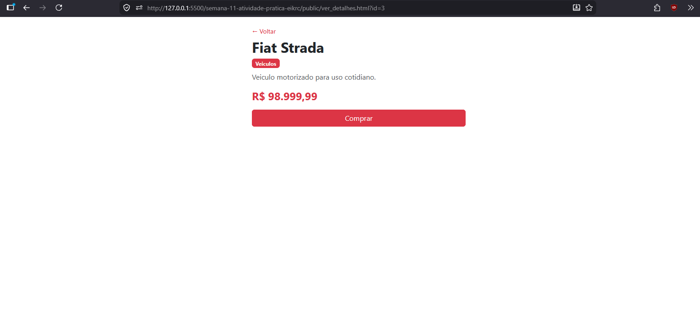

[](https://classroom.github.com/a/p4-FAIUK)
# Trabalho Prático - Semana 9

Nesta atividade, vamos montar um programa para praticar funções em JavaScript e a manipulação do DOM, criando uma tela simples no estilo eCommerce que lista produtos em cards a partir de um objeto JSON (array de produtos).

## Informações Gerais

- Nome: Erick Calixto David Silva
- Matricula: 924090

## Prints do trabalho













## Dados em JSON
Inclua aqui a estrutura de dados definida por você para o projeto com pelo menos dois exemplo de dados.

```json
[
            {"id": 0, "nome": "Kindle", "preco": "R$ 699,90", "categoria": "Smartphones", "descricao": "Usado para ler."},
            {"id": 1, "nome": "Bicicleta", "preco": "R$ 4.599,00", "categoria": "Veiculos", "descricao": "Usado para andar."},
            {"id": 2, "nome": "Raquete", "preco": "R$ 199,89", "categoria": "Esportes", "descricao": "Raquete para praticar esportes."},
        {"id": 3, "nome": "Fiat Strada", "preco": "R$ 98.999,99", "categoria": "Veiculos", "descricao": "Veiculo motorizado para uso cotidiano."}
];
```
